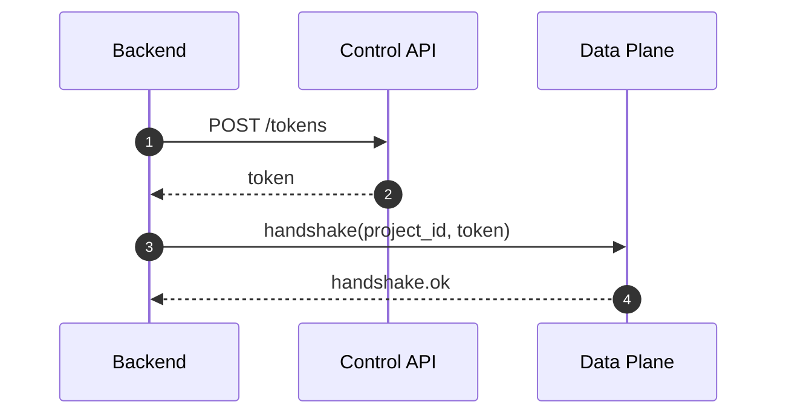

# Control API

Base URL (local): `http://localhost:3000`

Use the control API from your backend services, not directly from game clients.

## Projects

- `POST /projects`
- `GET /projects`

## Keys

- `POST /projects/:id/keys`
- `GET /projects/:id/keys`
- `POST /projects/:id/keys/:keyId/revoke`
- `POST /projects/:id/keys/:keyId/rotate`

## Tokens

- `POST /tokens`

Use from your backend to issue short-lived client tokens.

## Ops endpoints

- `GET /metrics`
- `GET /internal/key-status` (data-plane internal checks)

## Token payload fields

Nexis client tokens include:

- `project_id`
- `issued_at`
- `expires_at`
- optional `key_id`
- optional `aud`

Keep token TTL short for gameplay sessions.

## Example: mint token

```bash
curl -X POST http://localhost:3000/tokens \
  -H "content-type: application/json" \
  -d '{"project_id":"<project-id>","key_id":"<key-id>","ttl_seconds":900}'
```


## Token Mint Flow




## Typed Control API Call

```ts twoslash
type MintTokenRequest = {
  project_id: string;
  key_id: string;
  ttl_seconds: number;
};

type MintTokenResponse = { token: string; expires_at: string };

// ---cut-before---
async function mintToken(baseUrl: string, body: MintTokenRequest): Promise<MintTokenResponse> {
  const res = await fetch(`${baseUrl}/tokens`, {
    method: 'POST',
    headers: { 'content-type': 'application/json' },
    body: JSON.stringify(body),
  });

  return (await res.json()) as MintTokenResponse;
}
```
