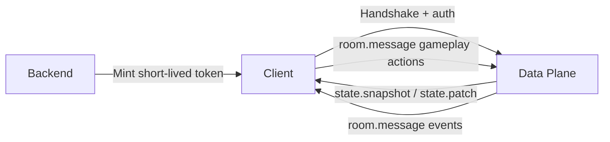

# Build a Real Game Loop

This page shows the practical production loop most games need.



## 1. Backend mints short-lived token

Your backend (not the client) calls control API:

```bash
curl -X POST http://localhost:3000/tokens \
  -H "content-type: application/json" \
  -d '{"project_id":"<project-id>","key_id":"<key-id>","ttl_seconds":900}'
```

Return the token to your authenticated player session.

## 2. Client connects to data plane

```ts twoslash
type NexisClient = {
  joinOrCreate(roomType: string, options: { room: string }): Promise<NexisRoom>;
};

type NexisRoom = {
  send(type: string, payload: unknown): void;
  onStateChange(cb: (state: unknown) => void): void;
  onMessage<T>(type: string, cb: (payload: T) => void): void;
};

declare function connect(
  url: string,
  options: { projectId: string; token: string },
): Promise<NexisClient>;

// ---cut-before---
async function start(token: string) {
  const client = await connect("ws://localhost:4000", {
    projectId: "<project-id>",
    token,
  });

  const room = await client.joinOrCreate("duel_room", { room: "arena-1" });
  room.send("player.move", { x: 10, y: 4, seq: 1001 });
}
```

Client receives initial `state.snapshot`.

## 5. Plugin/server applies authoritative logic

Room/plugin `on_message` handles:

- `input.type`
- `input.data`

It returns new authoritative room state and optional event payload.

## 6. Client receives state and events

```ts
room.onStateChange((state) => {
  renderWorld(state);
});

room.onMessage("combat.hit", (payload) => {
  showHitMarker(payload);
});
```

## 7. Reconnect and resume

On network interruption:

- SDK reconnects (if enabled)
- session resume can recover room state within configured TTL
- if sequence/checksum mismatch occurs, `state.resync` path restores consistency

## 8. Production guardrails

- keep tokens short-lived
- rate-limit gameplay message types
- validate message payload schema per room type
- monitor handshake/join/error rates
