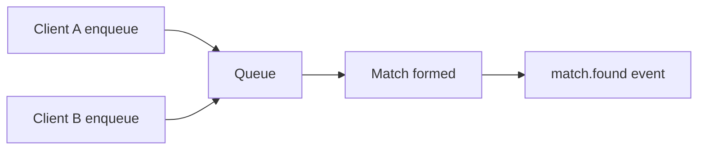

# Matchmaking

Use matchmaking when players should be grouped into a room automatically.

## Enqueue

```ts
await client.enqueueMatchmaking("counter_plugin_room", 2);
```

## Dequeue

```ts
await client.dequeueMatchmaking();
```

## Handle `match.found`

```ts
client.onMatchFound(async (match) => {
  await client.joinOrCreate(match.roomType, { roomId: match.room });
});
```

Ticket TTL and disconnect cleanup are handled server-side.


## Matchmaking Queue




## Typed Matchmaking API

```ts twoslash
type MatchFound = { room: string; room_type: string; size: number; participants: string[] };

type Client = {
  enqueueMatchmaking(roomType: string, size: number): Promise<void>;
  onMatchFound(cb: (payload: MatchFound) => void): void;
};

// ---cut-before---
async function queue(client: Client) {
  await client.enqueueMatchmaking('counter_plugin_room', 2);
  client.onMatchFound((payload) => {
    console.log(payload.room);
  });
}
```
