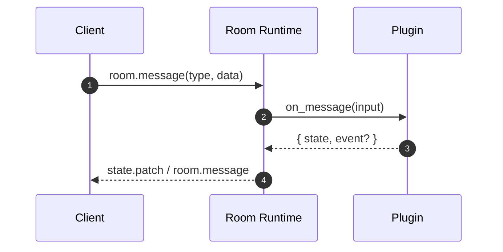

# Room Plugins

Room plugins are where your game rules live.

Use plugins when you want custom room behavior such as:

- movement simulation
- combat resolution
- inventory updates
- game-specific events/messages

## Two plugin modes

### 1) Rust plugin (compile-time)

Best when:

- you control server build/deploy
- you want native Rust performance and direct code integration

### 2) WASM plugin (runtime-loaded)

Best when:

- you want to ship new room logic without rebuilding data-plane image
- you want a stable host/plugin boundary

Configured through `NEXIS_WASM_ROOM_PLUGINS`.

Rust plugin authors can use the helper crate published on crates.io:

```toml
[dependencies]
nexis_wasm_plugin = "0.1.5"
serde_json = "1"
```

## Message contract inside plugins

Room message payload in plugin `on_message`:

```json
{
  "type": "player.move",
  "data": { "x": 10, "y": 4, "seq": 18 }
}
```

This means your plugin can define custom gameplay types freely (`player.move`, `shoot`, `chat.send`, etc.).

## Minimal plugin logic pattern

1. Read `input.type`.
2. Parse `input.data`.
3. Compute next authoritative state.
4. Return updated state and optional emitted event.

## References

- Tutorial: [Create a Custom Room Plugin](/docs/tutorials/custom-room-plugin/)
- Example code: `examples/wasm-plugins/counter_rust_plugin`


## Plugin Message Path




## Typed Plugin I/O

```ts twoslash
type PluginInput = { type: string; data?: unknown };
type PluginOutput = { state?: unknown; event?: { type: string; data?: unknown } };

// ---cut-before---
function onMessage(input: PluginInput): PluginOutput {
  if (input.type === 'inc') {
    return {
      state: { counter: 1 },
      event: { type: 'counter.updated', data: { counter: 1 } },
    };
  }

  return { state: {} };
}
```
