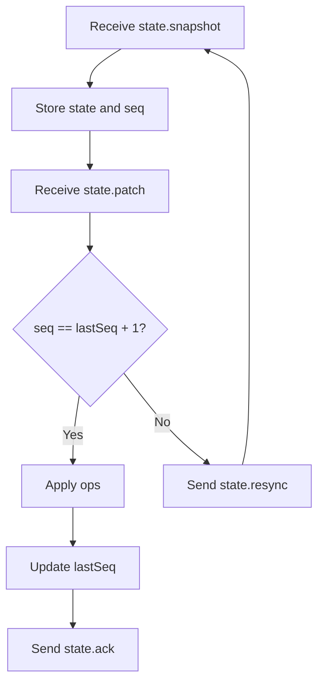

# State Synchronization

Nexis syncs room state through two message types:

- `state.snapshot`: full room state
- `state.patch`: incremental update ops

## Patch Shape

```json
{
  "seq": 43,
  "ops": [
    { "op": "set", "path": "/counter", "value": 4 },
    { "op": "del", "path": "/foo" }
  ],
  "checksum": "optional"
}
```

## Client responsibilities

- apply patches in order (`seq`)
- keep local state consistent
- ack processed updates with `state.ack`
- request `state.resync` if sequence gap or checksum mismatch

## Sync flow



## Recommended client loop

1. Receive `state.snapshot` on join.
2. Store `(state, seq, checksum?)`.
3. On each `state.patch`, verify `seq` ordering.
4. Apply patch ops.
5. Ack latest sequence.
6. If mismatch is detected, request `state.resync`.

```ts twoslash
type PatchOp =
  | { op: "set"; path: string; value: unknown }
  | { op: "del"; path: string };

type PatchMessage = {
  seq: number;
  checksum?: string;
  ops: PatchOp[];
};

// ---cut-before---
let lastSeq = 42;

function onPatch(msg: PatchMessage) {
  if (msg.seq !== lastSeq + 1) {
    requestResync();
    return;
  }

  applyOps(msg.ops);
  lastSeq = msg.seq;
  ack(msg.seq);
}

declare function requestResync(): void;
declare function applyOps(ops: PatchOp[]): void;
declare function ack(seq: number): void;
```

## Initial state

On successful room join, client receives `state.snapshot` so UI can render immediately.
