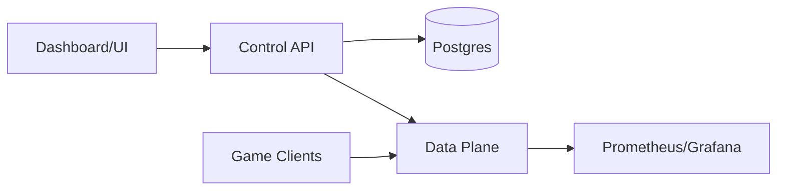

# Infrastructure Overview

Nexis is designed for self-hosting and hosted-ready patterns.

Typical production shape:

- data plane service (WebSocket)
- control API service (token + key lifecycle)
- Postgres for control-plane persistence
- your own game backend that mints player tokens

Gameplay traffic stays on data plane. Your game backend and control plane stay out of realtime packet flow.

For operator workflows, use the [Dashboard](/docs/infrastructure/dashboard/).


## Deployment Overview




## Typed Service Endpoints

```ts twoslash
type Services = {
  controlApiUrl: string;
  dataPlaneWsUrl: string;
  dataPlaneMetricsUrl: string;
};

// ---cut-before---
const services: Services = {
  controlApiUrl: 'http://localhost:3000',
  dataPlaneWsUrl: 'ws://localhost:4000',
  dataPlaneMetricsUrl: 'http://localhost:9100/metrics',
};
```
