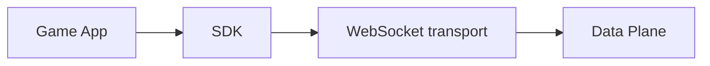

# SDKs

Nexis client SDKs are organized per language/runtime so teams can integrate with their engine stack cleanly.

## Available SDKs

- [TypeScript SDK](/docs/sdks/typescript/)

## Planned SDK tracks

- Rust / Bevy
- C# / Unity
- Godot (GDScript/C#)
- C++ (native engine integrations)

As new SDKs are added, they will appear in this section without mixing with protocol/control API references.


## SDK Integration Path




## Typed SDK Surface

```ts twoslash
type SDK = {
  connect(url: string, options: { projectId?: string; token?: string }): Promise<void>;
};

// ---cut-before---
const sdk: SDK = {
  async connect() {},
};

sdk.connect('ws://localhost:4000', { projectId: 'demo-project', token: 'token' });
```
